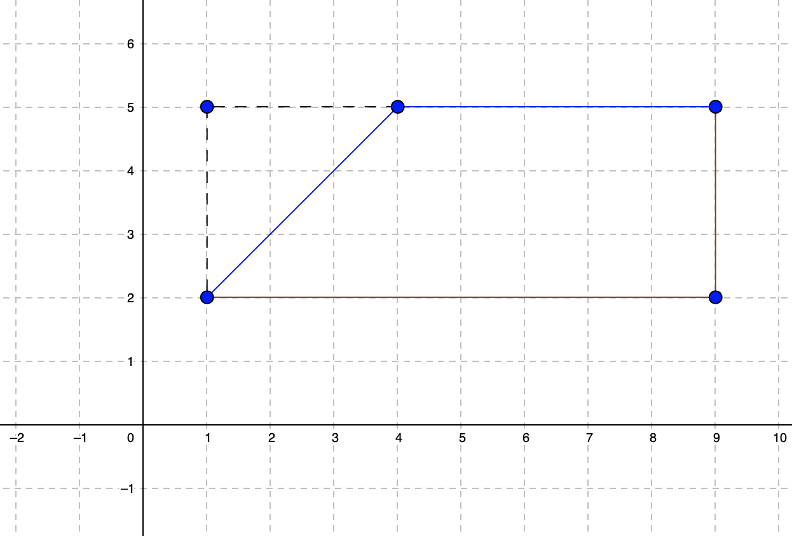

- Since we have to hit every point, let's just worry about the first two points and then just apply the same algorithms in a loop.

- So how do we get from point A(x1,y1) to point B(x2,y2)? Let's try going horizontal first and then vertical. 
```
horizontal = |x1-x2|
vertical   = |y1-y2|
result     = horizontal + vertical
```

- Now how do we minimize the time by going vertical? Let's look at an example: We want to go from (1,2) to (9,5).

```
horizontal = |1-9| = 8
vertical   = |2-5| = 3
```

- We can minimize by going diagonally by 3 and then horizontally by 5. When calculating the total minimized time, going diagonally by 3 and then horizontally by 5 (total of 8) is the same as going horizontally only (which is also 8).

- It might be easier to explain with the lines drawn on a grid. Take a look at this image:



The brown line is for going horizontally and then vertically. The blue line is the optimized route of going diagonally, then the remaining horizontally (since horizontal distance is larger than the vertical distance). Now notice the black dashed line. Imagine if you can rotate the diagonal blue line on the black dashed line. What does that tell us? Going diagonal by 3 is the same as going vertical by 3 and then horizontal by 3. Also note that 3 is not an arbitrary number, it's the vertical distance (to be more generic, the minimum of vertical and horizontal).

```
horizontal = |x1-x2|
vertical   = |y1-y2|
result     = horizontal + vertical - min(horizontal, vertical)
```

Now since we are subtracting the minimum of horizontal and vertical from the sum of horizontal and vertical, one of horizontal or the vertical term will cross out with the minimum of the two. Another way of putting this is max(horizontal, vertical) since the minimum terms will cancel out.

So our final code is simply:
```
horizontal = |x1-x2|
vertical   = |y1-y2|
result     = max(horizontal, vertical)
```
